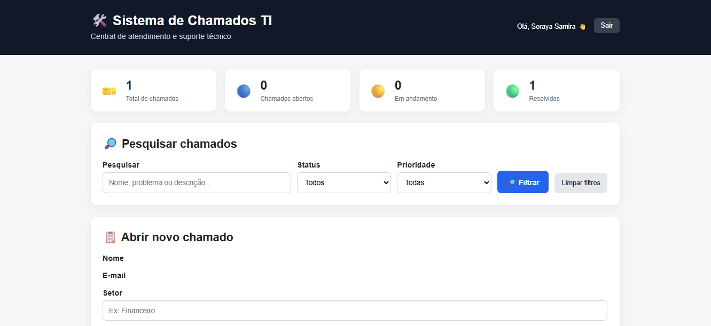

# 🖥️sistema-de-chamados-ti
Sistema interno de gerenciamento de chamados para empresas.

Link: https://sistema-de-chamados-ti-oficial.onrender.com/

## 🚀 Funcionalidades

- Cadastro e login de usuários
- Abertura de chamados
- Acompanhamento de chamados
- Técnicos de TI
- Atribuição de chamados
- Atualização de status
- Histórico de atendimento
- Comunicação entre funcionário e técnico

## 🛠️ Tecnologias

- Python
- Flask
- HTML
- CSS
- JavaScript
- SQLite/PostgreSQL

## 👨‍💻 Autora

Soraya Almeida
.
